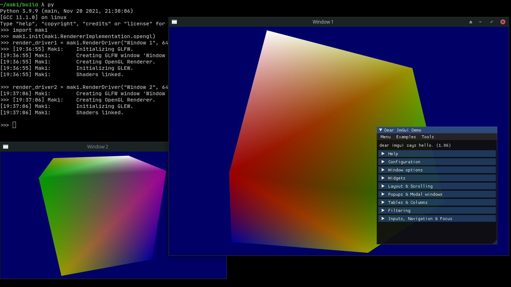

# Test Article

## I like cheese

```cpp
int main()
{
    std::cout << "C++ is so much better than JavaScript!" << std::endl;
    return 0;
}
```

```py
class Test(Scene):
    def construct(self):
        c = Cube()
        self.add(c)
```

```
I love you.
```

```
I like cheese.
```


